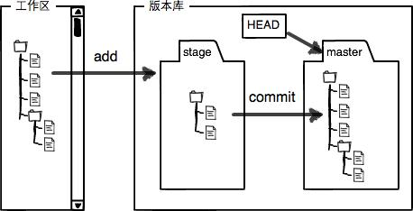
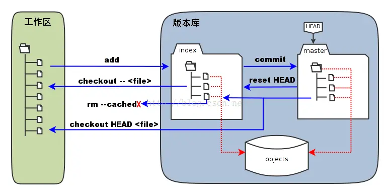
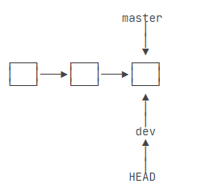
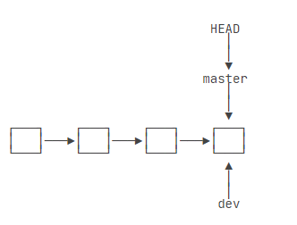

# 一份简单的 GIT 教程

> [!TIP] 首先明白在 GIT 中有几个概念：工作区---暂存区---版本库以及远程库
> 

- git add test.c &nbsp;&nbsp;&nbsp;&nbsp;工作区创建 text.c 文件，并**添加**到暂存区
- git commit &nbsp;&nbsp;&nbsp;&nbsp; 将文件从暂存区提交到版本库
- git reset --hard HEAD^ &nbsp;&nbsp;&nbsp;&nbsp; 回退到上一个版本
- git reflog&nbsp;&nbsp;&nbsp;&nbsp;用来记录你的每一次命令

---

## 管理修改

- git restore --staged test.md 可以将文件 test.md 从暂存区删除
- git reset HEAD test.md 将文件 test.md 从**版本库**将文件恢复到暂存区。
- git checkout -- test.md 命令分两种情况：
  1. 暂存区没有 test.md 的缓存，直接从版本库恢复到源文件
  2. 暂存区有关于 test.md 的缓存，从缓存库中恢复到源文件
- git fetch origin：从远程将文件复制到本地库

- 现在我在项目里添加了一个文件叫 test.c 文件，
  而且我已经提交给版本库，现在我手工把 test.c 文件从工作区删掉了。存在两种情况：
   1. 我删除错了，需要恢复，git checkout -- test.c :从版本库中将文件恢复到工作区。 
   2. 这个文件的确需要删除，那用 git rm test.c 从版本库中将 test.c 文件删除，然后使用 git commit -m “删除文件”进行确认，否则文件没有真的被删除。

## 分支管理

- HEAD 指向的就是**当前分支**.
- 当我们创建新的分支，例如 dev 时，Git 新建了一个指针叫 dev，指向 master 相同的提交，再把 HEAD 指向 dev，就表示当前分支在 dev 上
  
- 在 dev 上的工作完成了，就可以把 dev 合并到 master 上。Git 怎么合并呢？最简单的方法，就是直接把 master 指向 dev 的当前提交，就完成了合并

  

- 合并完分支后，可以删除 dev 分支。删除 dev 分支就是把 dev 指针给删掉。
- 分支就是指针操作。
- 创建新分支：git branch -c 分支名
- 切换分支：git switch 分支名
- 删除分支：git branch -d 分支名
- git merge dev：将分支 dev 合并到当前分支

## 标签管理

- 为某个提交打标签：git tag v1.0
- 查看标签：git tag
- 创建带有说明的标签，用-a 指定标签名，-m 指定说明文字:git tag -a v0.1 -m "version 0.1 released" 1094adb
- 删除标签：git tag -d v0.1
- 创建的标签都只存储在本地，不会自动推送到远程。要推送某个标签到远程，使用命令 git push origin 标签名
- 推送全部尚未推送到远程的本地标签：git push origin --tags
